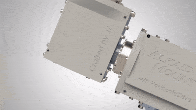

# Alkaid Mount - DIY Equatorial Mount with HarmonicDrive

Built by JZ.

For my build log, checkout [this page on my website](https://alanz.info/posts/2022/07/diy-mount/).

The following YouTube video documents all the processes with no explaination:

The same video can also be found on [bilibili](https://www.bilibili.com/video/BV1SR4y1X7bt/?share_source=copy_web&vd_source=4d6f936f693563e28752aadac9dd326f).

- Note: do not directly use the dxf files under the Machine/ folder.
They are for reference only and they might contain duplicated parts, because I had to make several parts more than once due to some mistakes at the beginning.
I'd recommend looking at the solidworks files first and try to understand every part, then generate your own dxf.

## Introduction
AlkaidMount is a DIY aluminum HarmonicDrive German style equatorial mount with a ~25lbs unbalanced or >70lbs balanced load capacity, with a self weight of only ~16lbs.
Each axis consists of a 100:1 HarmonicDrive gearbox, followed by a 27:1 planetary gearbox, driven by a Nema17 stepper motor.

Weight capacity is calculated with gearbox load limits as well as rigid body simulation.
Note that I have not yet done any torture tests, so those numbers are all theoratical. 
I've only tested it on the two scopes I own - an unbalanced Williams Optics GT71 setup (~15lbs) and balanced a Meade LX200 8" SCT setup (~25lbs not including the counterweights).
Both setups worked beautifully.

This repo contains ALL the design files (CAD, manufacture drawings, PCB files, software) to make the AlkaidMount.
I made this repo public to inspire other ideas.
Due to the difficulty in sourcing the exact same model of the two HarmonicDrive's (unless you buy new:), replicating the exact same mount would be hard. 
However modifying this design to suite other HD models shouldn't be too hard.

## BOM - Hardware
-----------
| Name | Quantity | Drawings | Datasheet |
| -------- | -------- | -------- | -------- |
| Harmonic Drive CSF-17-100-2UH-LW | 2 | [Drawings](https://www.harmonicdrive.net/_hd/content/caddownloads/dxf/csf-2uh_gearheads/csf-17-xx-2uh.pdf) | [Datasheet](https://www.harmonicdrive.net/products/gear-units/gear-units/csf-2uh/csf-17-100-2uh) |
| Nema 17 with 27:1 Planetary Gearbox | 2 | [Drawings](https://www.omc-stepperonline.com/download/17HS19-1684S-PG27.pdf) | [Datasheet](https://www.omc-stepperonline.com/nema-17-stepper-motor-bipolar-l-48mm-w-gear-ratio-27-1-planetary-gearbox-17hs19-1684s-pg27) |
| 1/8" Aluminum plate | 12"x12" minimum | - | - |
| 1/4" Aluminum plate | - | - | - |
| M4x8 | many :) | - | - |
| M3x8 | not that many :] | - | - |
| M5x8 | a few :{ | - | - |

## BOM - Electronics
-----------
| Name | Quantity | Drawings | Datasheet |
| -------- | -------- | -------- | -------- |
| Teensy 4.0 | 1 | - | - |
| ESP-32 (for wifi control) | 1 | - | - |

For parts on the PCB, see [PCB/parts.txt](PCB/parts.txt).

## Manufacturing guide

Most parts were made with 2D waterjetting, with not too much post-processing (tab removal, tapping if needed).
Some parts have holes on the side, so some milling was involved.
